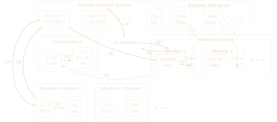

# CLaDS: A Cloud Based Lab for Data Science

The rise of the "big data" era has created a pressing demand for educating
many data scientists and engineers quickly at low cost.  It is essential
they learn by working on assignments that involve real world data sets to
develop the skills needed to be successful in the workplace.  However,
enabling instructors to flexibly deliver all kinds of data science
assignments using real world data sets to large numbers of learners (both
on-campus and off-campus) at low cost is a significant open challenge.

To address this emerging challenge generally, CLaDS has been developed to
enable many learners around
the world to work on real-world data science problems without having to
move or otherwise distribute prohibitively large data sets. Leveraging
version control and continuous integration, CLaDS provides a general
infrastructure to enable any instructor to conveniently deliver any
hands-on data science assignment that uses large real world data sets to as
many learners as our cloud-computing infrastructure allows at very low
cost.

## Deploying CLaDS in Your Classroom

_Coming soon!_
